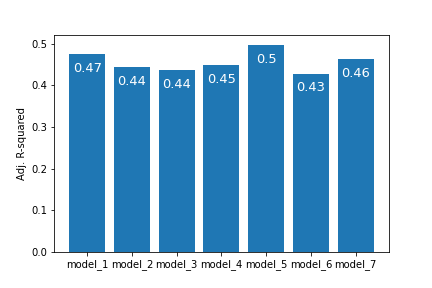

# Title

**Authors**: Daniel Arthur, Sumedh Bhardwaj, Emiko Naomasa


## Overview
The objectives of this project are twofold. (1) Create a prediction model that will help our stakeholder (Zillow’s) to predict future home prices. (2) Create an inferential model to help potential home buyers to find a house while balancing their budget constraints and their expectations for a house. We use a housing sales dataset from King County, which includes Seattle. The dataset includes the prices of houses sold between May 2014 and May 2015, as well as 20 various housing features, such as the square footage of the living space, the geographical locations of the house, and so on. With this dataset, we are building (1) a price prediction model using the feature engineering technique, and (2) an inferential model with a multiple regression model. 

## Business Understanding 

The stakeholders are Zillow. They are the most used online real estate site. The current model they use to evaluate the price of homes has a median error rate of 1.9%. However, this error rate increases to 2.3% in Washington. This results in 9.8% of houses being at or above a 10% error rate. This can equate to 10s of thousands of dollars on an individual scale and millions at a company level. We are creating a model to reduce the errors in the Washington area. Having a better model will encourage use of the site and increase revenue.

## Data
We cleaned the following 12 variables from the dataset, and we evaluated the outliers, the missed entries of data, and other issues in each variable.\
•	**id:** Unique identification (ID) for each sold house \
•	**date:** Date the house was sold \
•	**price:** Price of the house sold \
•	**bedrooms:** Number of bedrooms \
•	**bathrooms:** Number of bathrooms \
•	**sqft_living:** Square footage of the house’s interior living space\
•	**sqft_lot:** Square footage of the land space\
•	**floors:** Number of floors\
•	**waterfront:** A dummy variable for whether the house is on a waterfront \
•	**condition:** An index from 1 to 5 on the overall condition of the house. Related to maintenance of house. \
•	**grade:** An index from 1 to 13 on the grade of the house, where 1 means poor construction and design, and 13 means high quality. It is related to the construction and design of the house. \
•	**vintage:** House vintage (years) = the year the house was sold - the year the house was built
   
## Modeling

With the above dataset, we built (1) an inferential model with a linear regression model and (2) a price prediction model using the feature engineering technique. 
  
## Regression Results

  ### Inferential Model: Model to support customers’ house purchasing decisions

   We conducted linear regression analysis with seven model specifications. The adjusted R-squared scores in all seven models stayed low, at between 0.4 and 0.5 (Figure 1). This tells us that these models, regardless of specification, explain only 40–50% of the entire variation in house prices. This means more than half of the housing price movement is explained by other variables or is captured by types of models other than a linear regression model. 
   Additionally, the dataset we used had strong multicollinearity. Because most of the data were related to features of houses, such as the number of bedrooms and size of each house’s living space, each variable was strongly correlated with the others. Given the strong collinearity in the dataset, we decided to choose a single linear regression model against housing grade as our inferential model for the clients. 

  **Figure 1**



  ### Predictive Model: Model to support Zillow's price prediction for a new house
  
   Using infomation gleaned from the inferential models, we made a several predictive models. However the models we made performed less well than the model currently in use by our client. By running the predictive models with differenct data points selected by through our inferential modeling process, we were able to improve the accuracy of our model. We outperformed our baseline model, but our mrse is nearly 40% of our target.
  
  
  
  


  
## Conclusion
  
   In conclusion we recomend that Zillow continues to use their current model. The model they currenly use has an error rate of 2.3%. Our model had an error rate near 40%. The lack of homoskedasity and linear correlation suggests that linear regression models are not a good fit for this problem. Further infomation would help as well. Getting data about income in the area, population trends, and a myraid of other factors would reduce model error. 
   
  
  
  
## For More Information 
Please review our full analysis in our Jupyter Notebook or our presentation.
For any additional questions, please contact: [Daniel Arthur](https://www.linkedin.com/in/daniel-arthur-472b59224/), [Sumedh Bhardwaj](https://www.linkedin.com/in/sumedh-bhardwaj-932767202/), [Emiko Naomasa](https://www.linkedin.com/in/emiko-n-58782158/) 

  
## Repository Structure

```
├── README.md                           <- The top-level README for reviewers of this project
├── title.ipynb                         <- Concise summary of the project with all data science steps
├── Project 2.pdf                       <- PDF version of project presentation
├── Data                                <- Both sourced externally and generated from code, includes exploratory notebooks
└── Images                              <- Both sourced externally and generated from code
```  
Note: Large or sensitive files are listed in .gitignore and not pushed to GitHub.

  
  
  
